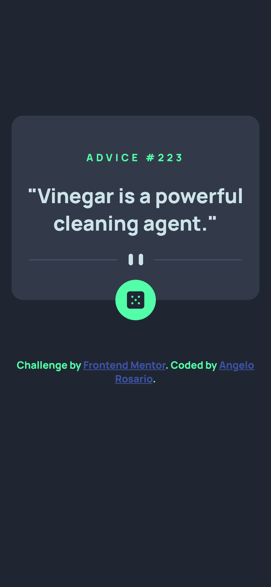
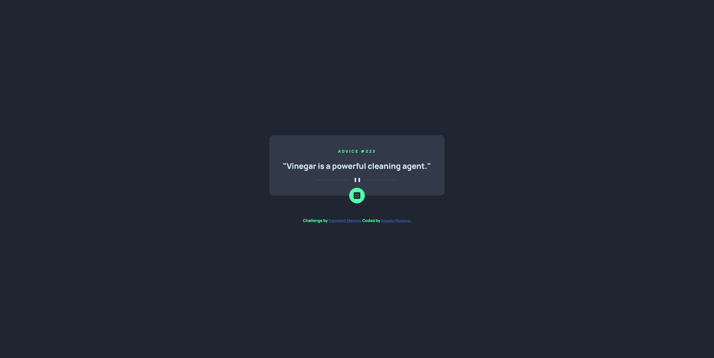

# Frontend Mentor - Advice generator app solution

This is a solution to the [Advice generator app challenge on Frontend Mentor](https://www.frontendmentor.io/challenges/advice-generator-app-QdUG-13db). Frontend Mentor challenges help you improve your coding skills by building realistic projects.

## Table of contents

- [Overview](#overview)
  - [The challenge](#the-challenge)
  - [Screenshot](#screenshot)
  - [Links](#links)
- [My process](#my-process)
  - [Built with](#built-with)
  - [What I learned](#what-i-learned)
  - [Continued development](#continued-development)
- [Author](#author)

## Overview

### The challenge

Users should be able to:

- View the optimal layout for the app depending on their device's screen size
- See hover states for all interactive elements on the page
- Generate a new piece of advice by clicking the dice icon

### Screenshot




### Links

- Solution URL: [GitHub](https://github.com/Sengsith/advice-generator)
- Live Site URL: [Netlify](https://hilarious-granita-820a71.netlify.app)

## My process

Since the design for this project was simple, I made sure to get the javascript section working as fast as possible. Otherwise, my usual workflow was to work on the custom properties, HTML, javascript, and general styling all in that order. There was one background color provided that I was unsure of where it was used so I decided to ignore it.

### Built with

- Semantic HTML5 markup
- CSS custom properties
- Flexbox
- Mobile-first workflowyles

### What I learned

This was an excellent refresher on how to use fetch, async, and await with vanilla javascript.

```js
async function getAdvice() {
  const response = await fetch(ADVICE_URL);
  const json = await response.json();
  const id = json.slip.id;
  const advice = json.slip.advice;
  adviceId.innerText = id;
  adviceContent.innerText = advice;
}
```

I did seem to run into an issue where clicking the button or refreshing the page wouldn't generate a new advice. I am unsure whether it was due to the way I wrote the code or if the API itself was just running slow.

### Continued development

While everything works, I am definitely interested in looking for ways to optimize my code even though this project was fairly simple.

## Author

- Frontend Mentor - [@Sengsith](https://www.frontendmentor.io/profile/sengsith)